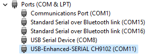
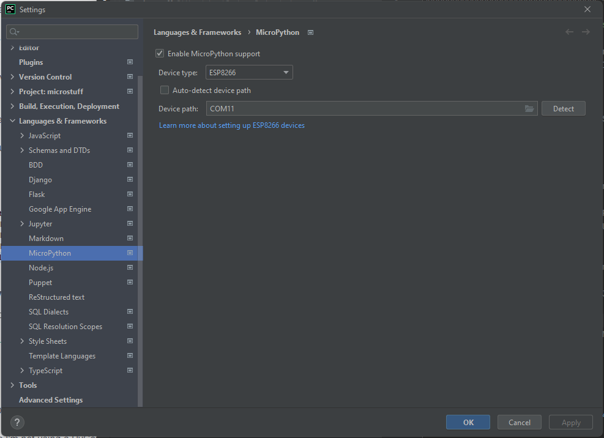
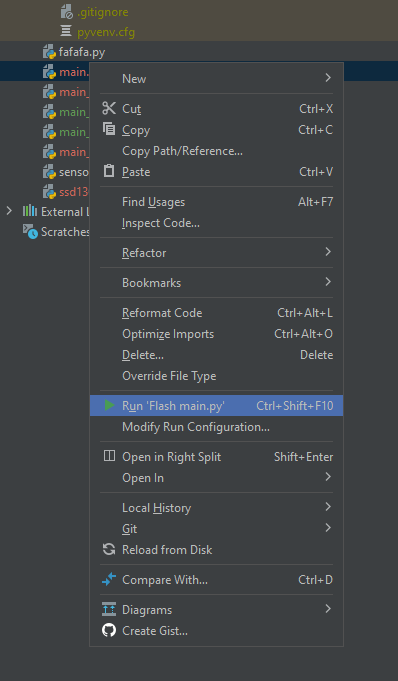
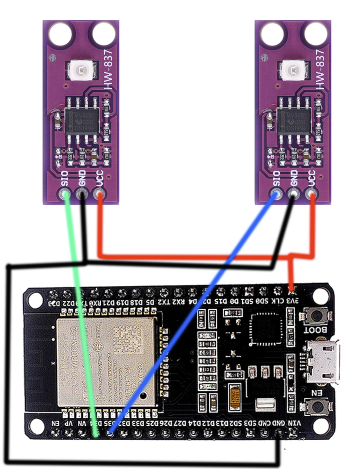
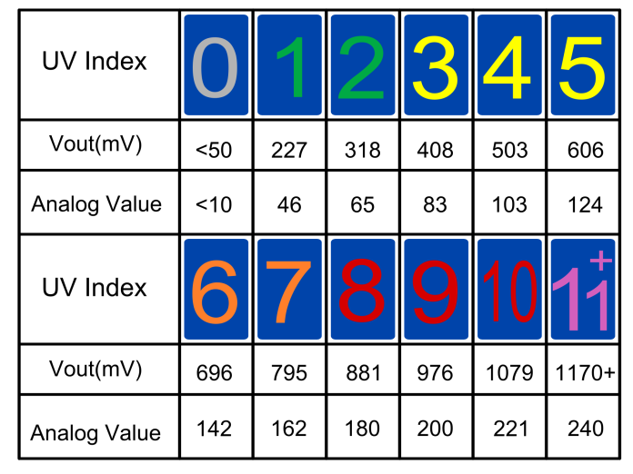
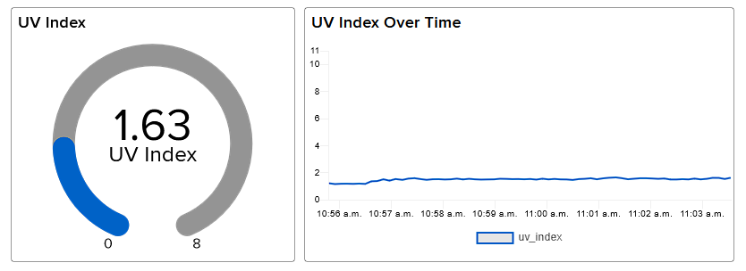
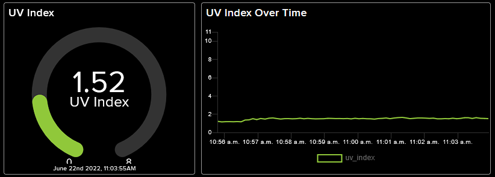
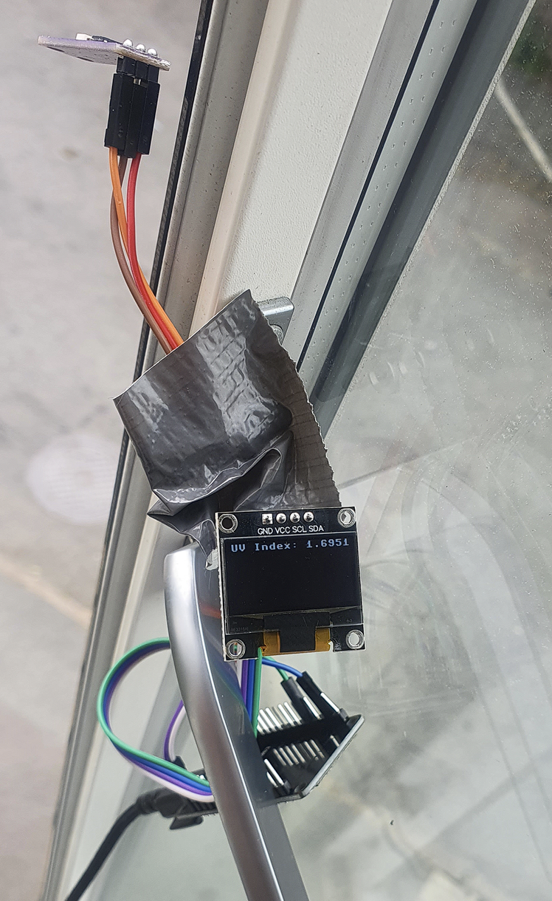
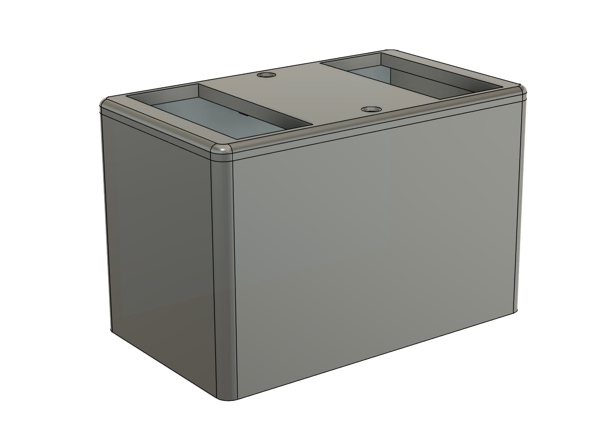
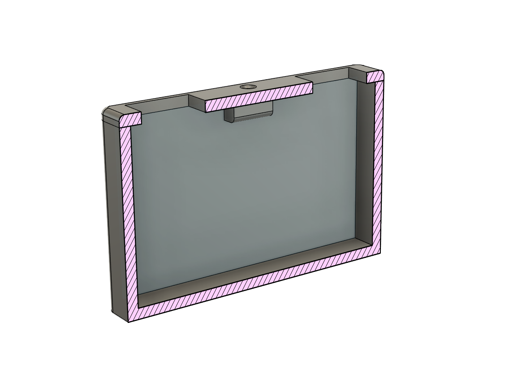

# 1DT305-Introduction-to-Applied-IoT

#### Internet connected UV sensor and data logging 
#### mf223xv

This device uses two UV sensors to gather UV-index data and sends it to over the internet to a dashboard on adafruit.io, in order to visualize the data using a gauge and a line chart.

Given that the the code for this project is open source, constructing a barebones (i.e not 3D-printed case) version of something like this should not take very long, 60-90 minutes should be enough if the user has some previous knowledge of microcontrollers and programming.

## Objective
I chose this project because excessive sun exposure can cause health concerns, and the hope is that knowing the UV-index, the user can take this into consideration when outdoors.

If data is logged long term-ish, it can give the user a rough idea of the UV exposure of a given location over time. My intended use of this is to place it on the balcony, to see whether it's fine to sit outside for a while longer, or if it's time to take a break from the sun.

## Material

#### BOM

| Item                                        | Image                                                                                                                                                                                                                   | Price  | Link                                                  |
|---------------------------------------------|-------------------------------------------------------------------------------------------------------------------------------------------------------------------------------------------------------------------------|--------|-------------------------------------------------------|
| ESP-32 Microcontroller                      |  | 45 SEK | https://www.aliexpress.com/item/1005002410521023.html |
| GUVA-S12SD UV Sensor                        |             | 25 SEK | https://www.aliexpress.com/item/1005002496494554.html |
| Assorted lengths of wire (or dupont cables) |                    | 40 SEK | https://www.aliexpress.com/item/4000203371860.html    |


##### Optional
3D printing filament (I used esun PLA) https://www.amazon.se/eSUN-3D-skrivarfilament-Dimensionell-Noggrannhet-3D-tryckmaterial/dp/B07FQ98RNP/?th=1

## Computer setup

I chose PyCharm as I have previous experience with this IDE, and it is free with a student license. To facilitate development with MicroPython I installed a plugin which makes it easy to flash the files.
[Link to plugin and usage images](https://plugins.jetbrains.com/plugin/9777-micropython)

I used Windows 11 for development in this course and did not have to install any extra drivers.

Download and install Python 3 from https://www.python.org/downloads/windows/

To setup the ESP-32 for usage with MicroPython, refer to this official guide: https://docs.micropython.org/en/latest/esp32/tutorial/intro.html.

Use the device manager on Windows to find what COM port to use (COM11 in my case).





Don't forget to select the correct port in PyCharm, in order to be able to flash the files.




## Putting everything together
Connect VCC to 3.3v and GND to GND, and the data pin to an analog pin on the ESP-32 (I used pin 32 and 34 for the UV sensors). I used F-F dupont cables for this while prototyping, but a breadboard would also work great.

 
 
 I'm using two UV sensors in order to get an average reading between the two of them, with the hopes of increasing accuracy. 
 
## Platform

I opted for the Adafruit IO platform (which is **cloud** hosted), as it was free, easy to set up, and had all the features I needed for the project.

I looked at PyBites but as I'm not using a PyCom device, I did not see any added value from using their platform over Adafruits.

## The code
The [full python code](https://github.com/ziggyt/1DT305-Introduction-to-Applied-IoT/blob/main/main.py) is available in this repository - but snippets of the more crucial parts are provided below.

This is basically the entire program, which runs indefinitely until the power is switched off. 

```python

setup_wifi()  # Pre-req
sync_time()  # Pre-req

while True:

    if START_HOUR < get_current_hour() < END_HOUR:  # Only check UV sensors if time is within the specified range

        uv_analog_value_a = adjust_analog_reading(uv_sensor_a.read())  # Read sensors
        uv_analog_value_b = adjust_analog_reading(uv_sensor_b.read())

        uv_avg = (uv_analog_value_a + uv_analog_value_b) / 2  # Get average of both readings

        if 0 < uv_avg < 11:  # if the value is outside this range, something has gone wrong
            if send_value_to_adafruit_feed(uv_avg,
                                           UV_INDEX_FEED):  # Finally, send the collected sensor data to Adafruit IO

                led_alert()  # Blink once if successful
                time.sleep(PRE_DEEPSLEEP_DELAY)  # Sleep before deepsleep to avoid weird states
        else:
            led_alert()  # This will only be reached if something has gone wrong with the readings. Flash LED once and try again. 
            continue

    machine.deepsleep(
        (RESOLUTION - PRE_DEEPSLEEP_DELAY) * 1000)  # To conserve energy we can use deepsleep (deepsleep is in ms)

```
**However**, this version resulted in [Errno 12] ENOMEM errors, indicating that the ESP-32 has run out of RAM, causing the post requests to the Adafruit IO feed to fail randomly. This could be solved by using http requests instead of https (since connections using SSL take up a lot more memory), but given that security is a prominent issue in IoT devices, I felt compelled to find another solution. 

A more scaled down version was created, which works just fine (but actually with an added feature; the addition of an OLED display that was used during troubleshooting, which I actually thought was a nice feature to have, to display the current UV index in proximity to the device.)

```python
################################### MAIN ##############################################

setup_wifi()  # Pre-req

while True:
    gc.collect()  # To avoid ENOMEM errors
    gc.threshold(gc.mem_free() // 4 + gc.mem_alloc())  # To avoid ENOMEM errors

    uv_analog_value_a = adjust_analog_reading(uv_sensor_a.read())  # Read sensors
    uv_analog_value_b = adjust_analog_reading(uv_sensor_b.read())

    uv_avg = (uv_analog_value_a + uv_analog_value_b) / 2  # Get average of both readings
    
    show_msg(f'UV Index: {uv_avg}')  # Show measured value on the OLED display

    if send_value_to_adafruit_feed(uv_avg, UV_INDEX_FEED):  # Finally, send the collected sensor data to Adafruit IO
        led_alert()  # Blink once if successful

    sleep(PRE_DEEPSLEEP_DELAY)  # Sleep before deepsleep to avoid weird states
    deepsleep((RESOLUTION - PRE_DEEPSLEEP_DELAY) * 1000)  # To conserve energy we can use deepsleep
    
```
At the beginning, you can see that the WiFi functionality is set up (connecting to a chosen SSID with a supplied password).

The sensors are then read (they are in fact connected to the analog pins, and return a specific voltage depending on the measured UV level)

 

The UV sensors are connected to 3.3v on the ESP32, which means that we need to adjust the reading to the 3.3v range in order to get a correct reading. 

```python
def adjust_analog_reading(value):  # Convert voltage range to 3.3v
    return (value * 3.3) / 1024
```

And this is the functionality that finally sends the data from the device to the Adafruit IO dashboard. It takes a value and a feed name and then constructs a post request (using urequests as requests) to the Adafruit IO API, and sends this data, using ur private key to identify who we are, and that we are allowed to post data to the feed. The key can be seen on the Adafruit IO dashboard.

```python
def send_value_to_adafruit_feed(value, feed_name: str):
    url = f'https://io.adafruit.com/api/v2/{ADAFRUIT_IO_USERNAME}/feeds/{feed_name}/data'
    body = {'value': str(value)}
    headers = {'X-AIO-Key': ADAFRUIT_IO_KEY, 'Content-Type': 'application/json'}

    try:
        requests.post(url, json=body, headers=headers)
        return True
    except Exception as e:
        print(e)
```
## Explain your code!

Right now data is sent **once every 7 seconds**, but this resolution can be increased as long as it complies with the Adafruit max rate (60 queries per minute).

It uses **WiFi**, as the ESP-32 has support for it. MQTT could have been used to first relay the data to a Raspberry Pi running an MQTT server, but since no treatment of data is done locally, this was not used.

I'm using the ESP-32 deep sleep functionality to not use as much power when idle. The device is connected to a net adapter in a wall socket and does not really need any further power consumption optimization - this was just done to eliminate wasteful use of energy.

The device is placed within range of the router, so no additional consideration of device range was needed in this case.

## Presenting the data

The dashboard is built using **Adafruit IO**, and it consists of a **gauge**, and a **line chart**. Different types of blocks can be added, but these blocks were the ones I felt were most suitable. 

Data policy by Adafruit is as follows: 

* Each feed stores data for 30 days.
* You can write data to the system, across all feeds, up to 60 times per minute. Data creating, updating, and deleting all count against the limit.
* You may read your data an unlimited amount of time, as long as you remain within the throttle times.
* 10k rows of "Activity" data is maintained. Activity data just tracks the last actions of your IO account on your Activities page for your information

There is as of now no automation for the data. However, one could use perhaps IFTTT to send a notification to your phone when the UV index is below or above a set threshhold, to notifiy the user if it's time to go put on sun screen. 




The data for these examples was gathered during a cloudy day, which is of course very shocking for summers in Sweden... But given that a sunny day shows up, I will add data for that day as well. 

## Finalizing the design
I think that the project went well and I had fun while doing it - but there is of course always room for improvement. An ESP-32 with more RAM would have resolved a few of my issues and made it possible to include more features in the product. It would also have been really nice if my 3D-printer would have been up and running, to see how a more finished product would have looked like. 

To make the project more of a "finished product", I threw together a quick case for it in Fusion360 - but the extruder on my 3D-printer broke, so I was unable to print it, and therefore stopped refining it. The .stl file is available in the repository if anybody wants to try it out.

Early version

 
 

Box made using Fusion 360

 
 
 
 

