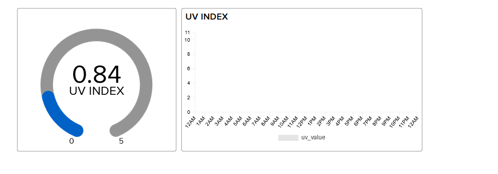

# 1DT305-Introduction-to-Applied-IoT

#### Internet connected UV sensor
#### mf223xv

This device uses two UV sensors to gather UV-index data and sends it to a dashboard on adafruit.io, to visualize it using a gauge and a plot.

Given that the the code for this project is open source, constructing a barebones (i.e not 3D-printed case) version of something like this should not take very long, apx 30 minutes if the user has some knowledge of microcontrollers.


## Objective
I chose this project because excessive sun exposure can cause health concerns, and the hope is that knowing the UV-index, the user can take this into consideration when outdoors.

If data is logged long term-ish, it can give the user a rough idea of the UV exposure of a given location over time. My intended use of this is to place it on the balcony, to see whether it's fine to sit outside for a while longer, or if it's time to take a break from the sun.

## Material

#### BOM
1pc ESP-32 Microcontroller (CH9102X version) 45 SEK including shipping https://www.aliexpress.com/item/1005002410521023.html
  
2pc GUVA-S12SD UV Sensors (or alternative UV-sensors) 25 SEK EA https://www.aliexpress.com/item/1005002496494554.html
  
Assorted lengths of wire (or dupont cables) 40 SEK https://www.aliexpress.com/item/4000203371860.html
  
  

##### Optional
3D printing filament (I used esun PLA) https://www.amazon.se/eSUN-3D-skrivarfilament-Dimensionell-Noggrannhet-3D-tryckmaterial/dp/B07FQ98RNP/?th=1

## Computer setup

I chose PyCharm as I have previous experience with this IDE, and it is free with a student license. To facilitate development with MicroPython I installed a plugin which makes it easy to flash the files.
[Link to plugin and usage images](https://plugins.jetbrains.com/plugin/9777-micropython)

I used Windows 11 for development in this course and did not have to install any extra drivers.

## Putting everything together
Connect VCC to 3.3v and GND to GND, and the data pin to an analog pin on the ESP-32 (I used pin 32 and 34).


## Platform

I opted for the Adafruit IO platform, as it was free, easy to set up, and had all the features I needed for the project.

I looked at PyBites but as I'm not using a PyCom device, I did not see any added value from using their platform over Adafruits.

## The code

Import core functions of your code here, and don’t forget to explain what you have done! Do not put too much code here, focus on the core functionalities. Have you done a specific function that does a calculation, or are you using clever function for sending data on two networks? Or, are you checking if the value is reasonable etc. Explain what you have done, including the setup of the network, wireless, libraries and all that is needed to understand.

This is basically the entire program, which runs indefinitely until the power is switched off. 

```python

setup_wifi()  # Pre-req
sync_time()  # Pre-req

while True:

    if START_HOUR < get_current_hour() < END_HOUR:  # Only check UV sensors if time is within the specified range

        uv_analog_value_a = adjust_analog_reading(uv_sensor_a.read())  # Read sensors
        uv_analog_value_b = adjust_analog_reading(uv_sensor_b.read())

        uv_avg = (uv_analog_value_a + uv_analog_value_b) / 2  # Get average of both readings

        if send_value_to_adafruit_feed(uv_avg, UV_INDEX_FEED):  # Finally, send the collected sensor data to Adafruit IO
            led_alert()  # Blink if successful
            time.sleep(PRE_DEEPSLEEP_DELAY)  # Sleep before deepsleep to avoid weird states

    machine.deepsleep(
        (RESOLUTION - PRE_DEEPSLEEP_DELAY) * 1000)  # To conserve energy we can use deepsleep (deepsleep is in ms)
```

At the beginning, you can see that the WiFi functionality is set up (connecting to a chosen SSID with a supplied password).

Then, a time server is queried to adjust the time of the ESP32, which is used to not send data to Adafruit IO when the UV is surely low enough to not need to be taken into consideration. This is of course optional, but I saw no value in collecting this data, for the purpose of this project. 

The sensors are then read (they are in fact connected to the analog pins, and return a specific voltage depending on the measured UV level)


The UV sensors are connected to 3.3v on the ESP32, which means that we need to adjust the reading to the 3.3v range in order to get a correct reading. 

```python
def adjust_analog_reading(value):  # Convert voltage range to 3.3v
    return (value * 3.3) / 1024
```


## Explain your code!

Right now data is sent once per minute, but this resolution can be increaserd as long as it complies with the Adafruit max rate.

It uses WiFi, as the ESP-32 has support for it. MQTT could have been used to first relay the data to a Raspberry Pi running an MQTT server, but since no treatment of data is done locally, this was not used.

I'm using the ESP32 deep sleep functionality to not use as much power when idle. The device is connected to a net adapter in a wall wart so this was done to just eliminate wasteful use of energy.

The device is placed within range of the router, so no additional consideration of device range was needed.

## Presenting the data

Describe the presentation part. How is the dashboard built? How long is the data preserved in the database?

Data policy by Adafruit is as follows: 

* Each feed stores data for 30 days.
* You can write data to the system, across all feeds, up to 60 times per minute. Data creating, updating, and deleting all count against the limit.
* You may read your data an unlimited amount of time, as long as you remain within the throttle times.
* 10k rows of "Activity" data is maintained. Activity data just tracks the last actions of your IO account on your Activities page for your information


There is as of now no automation for the data. However, one could use perhaps IFTTT to send a notification to your phone when the UV index is below or above a set threshhold, to notifiy the user if it's time to go put on sun screen. 

    Provide visual examples on how the dashboard looks. Pictures needed.
    How often is data saved in the database.
    *Explain your choice of database.
    *Automation/triggers of the data.


## Finalizing the design
